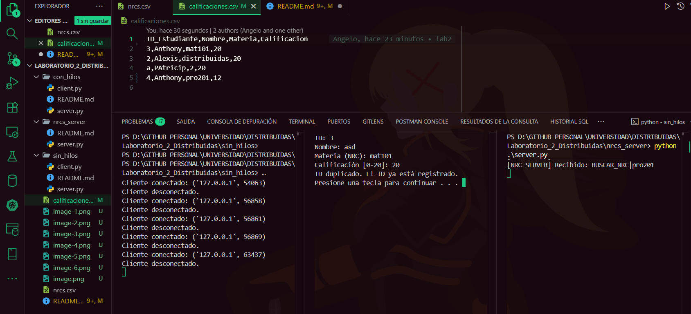
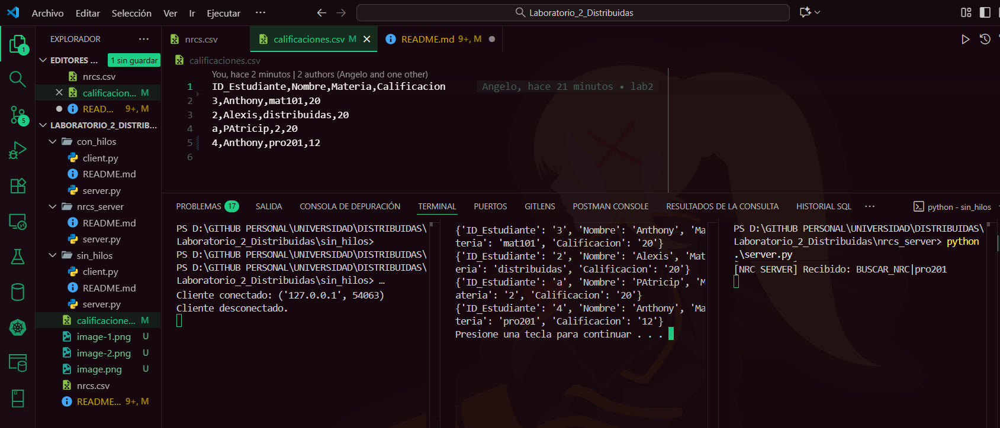
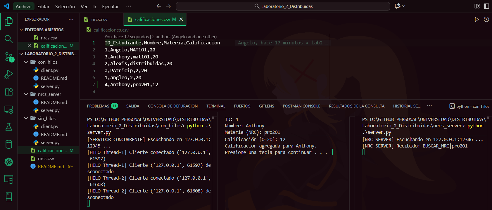
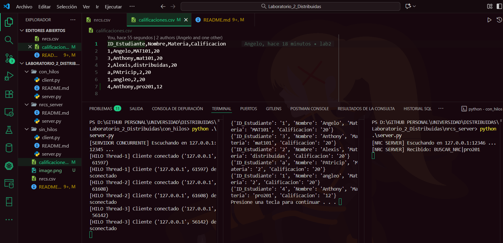
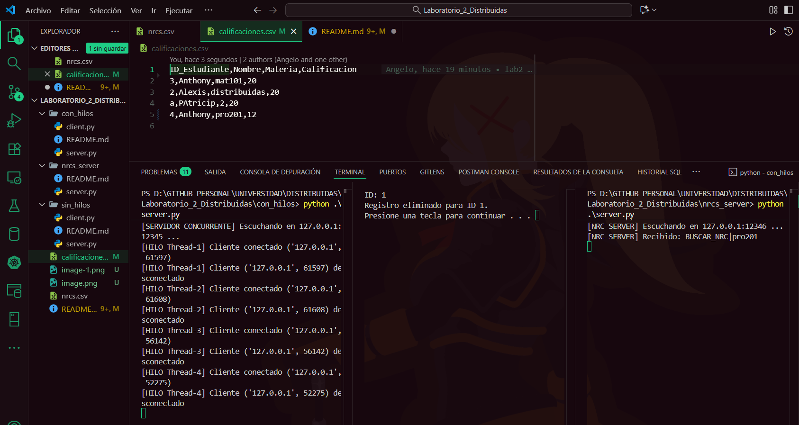

# Laboratorio 2 – Sistema Distribuido de Registro de Calificaciones
# Integrantes: Chimba Alexis, Sanchez Angelo, Villarreal Anthony

Este proyecto forma parte de la materia de Aplicaciones Distribuidas y tiene como objetivo implementar un sistema de registro de calificaciones utilizando sockets TCP. El trabajo se divide en dos etapas: un servidor secuencial sin concurrencia y una versión concurrente con validación de NRC a través de un segundo servidor.

---

## 1. Introducción

El laboratorio se basa en la construcción de un sistema distribuido simple con persistencia en archivos CSV. Primero se desarrolla un cliente y un servidor que permiten operaciones CRUD básicas sobre un archivo de calificaciones. Posteriormente, el sistema evoluciona a una versión concurrente que incorpora un microservicio para validar NRC antes de registrar o actualizar calificaciones.

---

## 2. Objetivos

### Objetivo general
Implementar un sistema distribuido cliente-servidor utilizando sockets TCP, con persistencia de datos y validaciones.

### Objetivos específicos
- Ejecutar operaciones CRUD sobre un archivo CSV usando sockets.
- Evitar IDs duplicados durante los registros.
- Implementar concurrencia con hilos.
- Incorporar un servidor adicional para validar NRC.
- Garantizar comunicación entre servidores.

---

## 3. Arquitectura del sistema

El proyecto está compuesto por tres módulos:

1. sin_hilos: servidor secuencial que atiende un cliente a la vez.
2. con_hilos: servidor concurrente que maneja múltiples clientes con hilos y valida NRC.
3. nrcs_server: microservicio que responde consultas sobre NRC válidos.

---

## 4. Parte 1 – Servidor sin hilos

El servidor secuencial atiende una conexión por vez. Este módulo permite:
- Registrar calificaciones
- Buscar por ID
- Actualizar una calificación
- Eliminar un registro
- Listar todos los registros

### Validación
- No se permite registrar un ID duplicado.
- Si el ID no existe en buscar, actualizar o eliminar, se responde con “ID no encontrado”.
Evidencia Validaciones:

### Evidencia de ejecución (ejemplo)
Entrada del cliente: Agregar Calificacion

Lista de calificaciones:

Eliminar por ID:

## 4. Parte 2 – Servidor con hilos

El servidor secuencial atiende una conexión por vez. Este módulo permite:
- Registrar calificaciones
- Buscar por ID
- Actualizar una calificación
- Eliminar un registro
- Listar todos los registros

### Validación
- No se permite registrar un ID duplicado.
- Si el ID no existe en buscar, actualizar o eliminar, se responde con “ID no encontrado”.
Evidencia Validaciones:

### Evidencia de ejecución (ejemplo)
Entrada del cliente: Agregar Calificacion

Lista de calificaciones:

Eliminar por ID:

